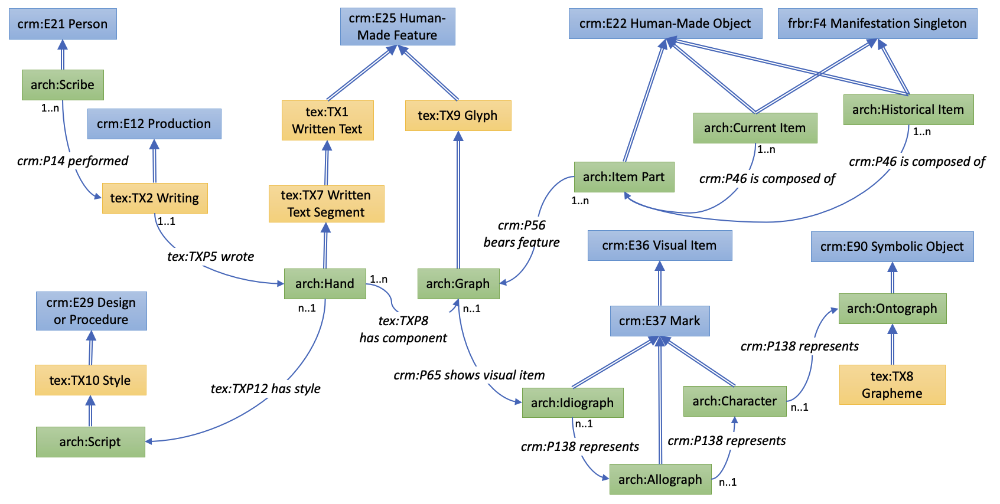

# The Archetype Ontology

An implementation of a formal ontology for the Archetype model of writing.

This is a version of an implementation of the Archetype ontology applied specifically to manuscript books. It builds on [the Erlangen implementation of CIDOC-CRM version 7.1.1](https://github.com/erlangen-crm/ecrm/blob/master/ecrm_211015.owl), with some classes and properties from the CRMtex extension to the CIDOC-CRM v1.0 (http://www.cidoc-crm.org/crmtex/).

The conceptual model is represented in the diagram below. This is provided to help understanding, but please be aware that there will likely be minor inconsistencies between the diagram and the OWL implementation.

For Archetype itself, including the team responsible for the original model, see https://github.com/kcl-ddh/digipal.

This is a work in progress. Comments and suggestions are welcome.

Peter A. Stokes

École Pratique des Hautes Études – Université PSL\
Archéologie et Philologie d’Orient et d’Occident (UMR 8546)

---

---

 This work is licensed under a [Creative Commons Attribution-ShareAlike 4.0 International License](http://creativecommons.org/licenses/by-sa/4.0/) (necessarily restrictive due to licences of Erlangen source).
