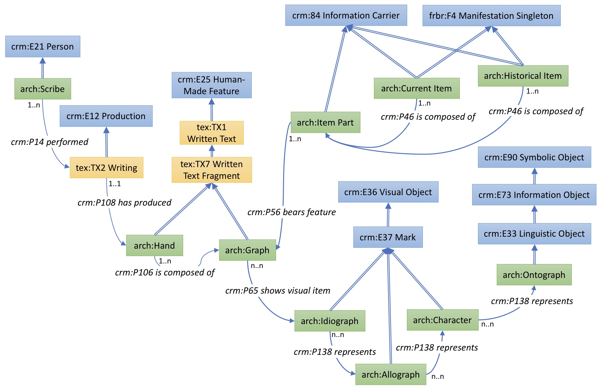

# The Archetype Ontology

An implementation of a formal ontology for the Archetype model of writing.

This is a first version of an implementation of the Archetype ontology applied specifically to manuscript books. It builds on the 'Florus' implementation of the Biblissima ontology (https://doc.biblissima.fr/ontologie-biblissima) which in turn is based on the Erlangen implementation of FRBRoo. It also includes some classes from the CRMtex extension to the CIDOC-CRM (http://www.cidoc-crm.org/crmtex/).

The conceptual model is represented in the diagram below. This is provided to help understanding, but please be aware that there may be minor inconsistencies between the diagram and the OWL implementation.

For Archetype itself, including the team responsible for the original model, see https://github.com/kcl-ddh/digipal.

This is a work in progress. Comments and suggestions are welcome.

Peter A. Stokes

École Pratique des Hautes Études – Université PSL\
Archéologie et Philologie d’Orient et d’Occident (UMR 8546)

---

---

 This work is licensed under a [Creative Commons Attribution-NonCommercial-ShareAlike 4.0 International License](http://creativecommons.org/licenses/by-nc-sa/4.0/) (necessarily restrictive due to licences of Erlangen and Biblissima sources).
